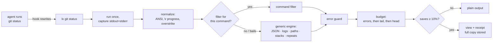

# lx

**Your coding agent reads every line a command prints. lx makes it read the lines that matter, and it never hides an error.**

[](https://github.com/iheeb1/lx/actions/workflows/ci.yml)    

`lx` sits between an AI coding agent (Claude Code, Codex, Gemini CLI, Copilot, Cursor…) and the commands it runs (`git`, `go test`, `pytest`, `jest`, `tsc`, `eslint`, `grep`, `find`, `npm`, `docker`…). It prints a condensed view of their output. The exit code stays the same, every error survives, and anything lx removes can be printed back (`lx show 7`).

| | |
|---|---|
| **91%** | fewer tokens across 116 real command outputs from 11 open-source repos (exact o200k counts) |
| **99%** | of application `file:line` locations kept on failing runs, against **61%** for a head+tail cut to the same size |
| **65** | command filters across git, Go, JS/TS, Python, search/listing, builds, HTTP/JSON and containers, plus a shape-aware engine for every other command |
| **0** | dependencies. It is one static Go binary, with no telemetry and no network code (CI fails if a networking package is linked in) |

## Highlights

- **It never hides an error.** On failing runs lx keeps 96% of the distinct error messages, where a head+tail cut to the same size keeps 64% and `| tail -40` keeps 47%. A runtime guard re-adds any error line a filter dropped, the exit code is never changed, and every condensed run can be printed back with `lx show`. → [Guarantees](#guarantees)
- **Twice rtk's savings, twice its errors.** Head to head on 70 live commands, lx saved 69% of the tokens against rtk's 32%, and kept 95% of the error messages on failing runs against 43%. → [Head to head](#head-to-head-with-rtk)
- **Logs an agent can read.** A 2,000-line log becomes one line per kind of error, with its count and the values that vary, and one count line per routine message. Over 14 real system logs that is 96% of the error kinds and 65% of the message types for 3.5% of the tokens; `rtk log` shows 9% and 2%. → [Logs](#logs)
- **It knows what the agent is doing.** Inside Claude Code and Codex, lx reads the session: it keeps the tests and files the agent is working on, tightens its views as the context fills, and a re-run shows only what changed (250 lines down to 17). → [Context-aware](#context-aware)
- **It learns.** When the agent has to read a run back in full, lx shows more of that command next time, per project (`lx tune`). → [Commands](#commands)
- **Safe to switch on.** The hook respects your deny and ask rules, `lx init --readonly` keeps read-only commands prompt-free, and `lx doctor` checks the whole setup. → [Use it with your agent](#use-it-with-your-agent)
- **Measure it first.** `lx discover` replays your own session transcripts and reports what lx would have saved, and whether its views kept what your agent acted on. → [Commands](#commands)

---

## Before / after

A failing `go test ./...` in [spf13/cobra](https://github.com/spf13/cobra). The raw output is 306 lines, most of it passing tests' logs. Here is what the agent reads through lx:

```text
$ lx go test ./...
--- FAIL: TestMinimumNArgs_WithLessArgs (0.00s)
    args_test.go:73: Expected "requires at least 2 arg(s), only received 1", got "requires at least 2 arg(s), received 1"
--- FAIL: TestMinimumNArgs_WithLessArgs_WithValid (0.00s)
    args_test.go:73: Expected "requires at least 2 arg(s), only received 1", got "requires at least 2 arg(s), received 1"
--- FAIL: TestMinimumNArgs_WithLessArgs_WithValid_WithInvalidArgs (0.00s)
    args_test.go:73: Expected "requires at least 2 arg(s), only received 1", got "requires at least 2 arg(s), received 1"
--- FAIL: TestFind (0.00s)
    --- FAIL: TestFind/[child_-f_child] (0.00s)
        command_test.go:2876: Wrong args
            Expected: [child -f child]
            Got: [-f child]
[error-like lines printed by passing tests (the rest of their output is hidden):]
Error: at least one of the flags in the group [a b] is required [×4]
[… 11 more such lines, trimmed for this README]
FAIL
FAIL	github.com/spf13/cobra	0.655s
ok  	github.com/spf13/cobra/doc	(cached)
FAIL
[hidden: 237 lines of passing-test output]
[lx: 307→29 lines (−71%) · full output: lx show 1]
```

Every failing test, assertion and `file:line` is still there, in the tool's own format. The last line tells the agent the view is condensed and how to get everything back.

## Results

All numbers below come from `make bench` on real captures. They are reproducible: see [Benchmarks](#benchmarks).


### Fewer tokens is only half the job

The obvious way to save tokens is to cut output: `| tail -40`, or head+tail truncation. Agents already do this, and it drops the error you needed. This chart takes every **failing** run in the corpus and compares lx with the same output cut blind, **to the same number of tokens as lx's view**:


At the same size, lx keeps 96% of the distinct error messages against 64% for head+tail and 47% for `tail -40`. For application `file:line` locations it keeps 99% against 61% and 39%. The error messages lx doesn't show are section headers and passing-test titles that the line classifier matches (for example jest's `Summary of all failing tests` and mocha's `error handling` suite name). `bench/cmd/missing` lists every one of them.

### Head to head with rtk

[rtk](https://github.com/rtk-ai/rtk) (Rust Token Killer) is the popular tool in this space and the inspiration for lx. Both tools ran the same 70 read-only commands, live, in the same repositories. Each tool decided for itself whether to wrap a command (`rtk rewrite` / `lx rewrite`), exactly as its agent hook would. Five runs are excluded because rtk couldn't launch the tool in the benchmark environment (vitest through a missing pnpm, and eslint), which says nothing about its filtering. The full method is in [docs/benchmark.md](docs/benchmark.md).


rtk is terser on some outputs. It summarizes a passing `go test` as one line, lists `find` results compactly, and caps `git log` at 10 commits. lx saves more tokens overall because it also condenses what rtk passes through: minified grep hits, `git blame`, `rg --files`, mocha, `npm ls`. On failing runs lx keeps 95% of the error messages against rtk's 43%, which matters most there. It is also faster:


The agent hook is quick too: `lx hook claude` takes about 5 ms per call including process start, against about 19 ms measured for rtk's hook.

rtk covers more ground: 100+ commands, 18 agents, a large community. lx takes a different position:

| | rtk 0.50 | lx |
|---|---|---|
| Verdict and counts | parsed from text; known false passes, e.g. pytest `3 passed, 1 error` shown as `3 passed` | the tool's own summary line, copied verbatim; the verdict always agrees with the exit code |
| Exit code | preserved, except `golangci-lint` 1 → 0 | always preserved (a property test checks it) |
| Dropped errors | per filter | caught at runtime by an error guard, plus fidelity tests on 116 real captures |
| Lost output | several filters truncate with no way back | every condensed run is stored; `lx show <id> [--grep RE] [--lines A-B]` |
| Unknown commands | passed through raw | shape-aware engine: JSON, logs, path lists, stack traces, repeated lines |
| Token counting | bytes ÷ 4 (≈19% mean error) | pre-tokenizer estimator (≈6% mean error vs o200k), [details](docs/tokens.md) |
| Savings accounting | head/tail counted as saving the whole file; negatives clamped | signed, measured against what the command actually printed |
| Model-written `rtk git push` | escapes `Bash(git push:*)` deny rules | `lx git push` is checked against deny rules as `git push` |
| Commands run | often twice (e.g. `git status`) | exactly once, with your exact argv |

### Logs

Agents read logs too: `docker logs`, `kubectl logs`, `journalctl`. [loghub](https://github.com/logpai/loghub) publishes 2,000-line samples of real system logs, with the template of every line, which makes it possible to count what a condensed view drops. The benchmark reads 14 of them the way an agent reads a container's log, with `docker logs app`. Each ran raw, through rtk, and through lx: at its default budget, at smaller budgets, with a task from the agent's session, and with Laya, an optional local model ([integrations/laya](integrations/laya)) that lx can ask which parts of an output are routine.

A log is mostly the same few messages, repeated. Zookeeper's sample has 291 copies of one warning that differ only in the timestamp and in which of three servers logged it:

```text
2015-07-29 19:21:35,084 - WARN  [RecvWorker:188978561024:QuorumCnxManager$RecvWorker@762] - Connection broken for id 188978561024, my id = 2, error =
2015-07-29 19:21:38,426 - WARN  [RecvWorker:188978561024:QuorumCnxManager$RecvWorker@762] - Connection broken for id 188978561024, my id = 2, error =
… 289 more
```

lx shows each kind of error or warning once, verbatim, with its count, the last one's timestamp and the values that vary (here, which server), and each routine message as one count line:

```text
2015-07-29 19:21:35,084 - WARN  [RecvWorker:188978561024:QuorumCnxManager$RecvWorker@762] - Connection broken for id 188978561024, my id = 2, error = [×195, last 2015-07-29 19:37:18,925]
    vars: id 3 ×99, 2 ×96
[×299] - INFO [/<IP>:QuorumCnxManager$Listener@<N>] - Received connection request /<IP>
```

The whole log becomes 68 lines that show all 50 of its templates and all 12 kinds of warning. When records differ in a word rather than a number, the `vars:` line names it: OpenSSH's 139 failed logins read `vars: Failed password ×135, none ×4; user ×57 distinct: admin ×45, support ×6, oracle ×6, …`.


| 14 logs, 28,000 lines | Tokens | Saved | Templates shown | Error kinds shown | Error lines verbatim | Median time |
|---|---|---|---|---|---|---|
| raw (`docker logs app`) | 1,540,125 | | 100% | 100% | 100% | 11 ms |
| rtk 0.50, its hook's rewrite (`rtk docker logs app`) | 3,436 | 99.8% | 0.8% | 3.4% | 0.4% | 20 ms |
| `rtk log app.log` | 5,831 | 99.6% | 2.0% | 8.8% | 0.9% | 15 ms |
| **lx** | **53,957** | **96.5%** | **65.2%** | **96.2%** | 3.9% | 68 ms |
| lx + task | 55,820 | 96.4% | 67.5% | 96.6% | 3.9% | 87 ms |
| lx `--mode minimal` (2,000 tokens) | 22,186 | 98.6% | 29.2% | 73.1% | 1.7% | 67 ms |
| lx, 1,000-token budget | 12,641 | 99.2% | 16.3% | 51.7% | 1.4% | 65 ms |
| lx, 500-token budget | 6,236 | 99.6% | 9.0% | 34.5% | 0.5% | 66 ms |
| lx + laya | 53,985 | 96.5% | 65.2% | 96.2% | 3.9% | 1,105 ms |
| lx + laya + task | 55,820 | 96.4% | 67.5% | 96.6% | 3.9% | 1,184 ms |
| lx + laya, 30 s timeout | 54,222 | 96.5% | 65.0% | 95.4% | 3.9% | 1,132 ms |

*Templates shown* counts the log's 1,300 ground-truth templates that have a line, or a count line, in the view. A line copied from the log, whole or cut short, counts for its own template only. *Error kinds* counts the 238 of them that have warning, error or fatal lines. Tokens are exact o200k counts. The times are medians over the 14 logs, from an M1 Pro. How each number is measured is in [docs/benchmark.md](docs/benchmark.md#logs-benchcmdlogbench).

**At the same size, lx shows about 4 times as much.** With a 500-token budget, lx's views add up to 6,236 tokens, about what `rtk log` prints (5,831). They show 9.0% of the templates against 2.0%, and 34.5% of the error kinds against 8.8%. Errors come first: when the budget can't hold them all verbatim, lx prints the rest as one count line each, with their cause lines. At its default budget lx shows two thirds of the templates and 96% of the error kinds for 3.5% of the raw tokens.

**Where rtk wins.** It is smaller and faster. At the default budget lx's views are 9 times the size of `rtk log`'s, and take 68 ms against 15 ms (up to 146 ms, on HPC). rtk's views show almost nothing, though: `rtk docker logs` asks docker for the last 100 lines only, rtk's log filter counts INFO lines without showing any of them, and it cuts the examples it keeps to 100 characters. `rtk log` shows no template at all on Hadoop, Spark and OpenStack, and rtk's hook path shows none on 7 of the 14 logs.

**Where lx falls short.** Few error lines are verbatim (3.9%), because lx shows each kind once; the count, the last timestamp and the `vars:` line stand in for the rest, and `lx show 1 --errors` prints them all. It misses 9 of the 238 error kinds, mostly where loghub's templates are finer than lx's merges: on OpenSSH, `Failed none for invalid user` shares a line with `Failed password …`, and only the `vars:` line names it. On BGL and Mac the budget runs out before the routine templates do: lx shows 86 of BGL's 120 templates and 78 of Mac's 337.

**Laya changed nothing that this measure sees.** lx asked it on 10 of the 14 logs; on the other 4 the view was already small. Its confidence rarely reaches lx's threshold (0.65, or 0.80 in `error` mode): in the scored runs it marked 6 templates routine on Linux and 1 on Android, which only reorders what a tight budget drops. How much it judges before lx's 1.2 s deadline varies from run to run (6 to 16 of the 24 items lx sent on BGL). With a 30 s timeout it kept 1 to 3 templates in full on 5 logs and marked up to 7 routine on 6, and the scored views lost 0.8 points of error kinds, because the templates it kept in full took room that warnings needed. It costs about 1 s per run, a 0.9 GB venv plus a 0.85 GB model, 10 s to load, and 1.5 GB of memory in the daemon.

**The task comes from the session, not from Laya.** Here the agent's question was in the session ("Why are HDFS block transfers failing?"). Five of the 14 tasks read as debugging, *why … failing* or *what is causing …*, and put lx in `error` mode, with 1.5× the budget: 2.3 more points of templates and 0.4 more of error kinds, for 3.5% more tokens.

lx's five smaller log fixtures cover docker compose, docker, journalctl and kubectl, with 100 to 270 lines each. On them, lx keeps all 14 error kinds, at 93.3% saved. rtk's hook passes three of the five through raw. `rtk log` keeps 12 of the 14 kinds, at 95.7% saved. Neither tool condenses `cat app.log`: lx's hook leaves `cat` alone, and `rtk read` prints the file whole.

<details>
<summary>Per log: tokens, templates and error kinds shown (rtk · rtk log · lx)</summary>

| Log | Raw | rtk | rtk log | lx | Templates shown | Error kinds shown | lx time |
|---|---|---|---|---|---|---|---|
| HDFS | 96,898 | 41 | 241 | 761 | 0 · 1 · 13 of 14 | 0 · 1 · 1 of 1 | 52 ms |
| Hadoop | 128,687 | 313 | 634 | 6,547 | 0 · 0 · 105 of 114 | 0 · 0 · 12 of 12 | 58 ms |
| Spark | 70,536 | 41 | 35 | 1,078 | 0 · 0 · 33 of 36 | none | 51 ms |
| Zookeeper | 108,318 | 394 | 657 | 3,218 | 1 · 2 · 50 of 50 | 1 · 2 · 12 of 12 | 48 ms |
| BGL | 141,636 | 713 | 850 | 7,510 | 0 · 1 · 86 of 120 | 0 · 1 · 75 of 77 | 132 ms |
| HPC | 45,422 | 203 | 481 | 1,701 | 1 · 3 · 31 of 46 | 1 · 3 · 15 of 15 | 146 ms |
| Thunderbird | 130,488 | 41 | 351 | 8,082 | 0 · 2 · 128 of 149 | 0 · 2 · 10 of 10 | 107 ms |
| Linux | 86,361 | 67 | 305 | 2,710 | 1 · 2 · 73 of 118 | 0 · 1 · 12 of 14 | 71 ms |
| Android | 100,980 | 83 | 269 | 6,883 | 1 · 2 · 157 of 165 | 0 · 0 · 15 of 15 | 42 ms |
| HealthApp | 72,555 | 41 | 75 | 1,354 | 0 · 1 · 23 of 75 | 0 · 1 · 3 of 3 | 78 ms |
| Apache | 64,500 | 605 | 602 | 490 | 2 · 3 · 6 of 6 | 1 · 2 · 4 of 4 | 59 ms |
| OpenSSH | 84,716 | 357 | 428 | 1,652 | 1 · 3 · 24 of 27 | 1 · 3 · 12 of 15 | 66 ms |
| OpenStack | 298,335 | 139 | 282 | 4,145 | 0 · 0 · 41 of 43 | 0 · 0 · 2 of 2 | 105 ms |
| Mac | 110,693 | 398 | 621 | 7,826 | 4 · 6 · 78 of 337 | 4 · 5 · 56 of 58 | 139 ms |

</details>

## Install

```sh
brew install iheeb1/tap/lx          # macOS / Linux with Homebrew
# or
curl -fsSL https://github.com/iheeb1/lx/releases/latest/download/install.sh | sh
lx version
```

The script picks the archive for your system (macOS or Linux, amd64 or arm64) and checks it against the release's `SHA256SUMS`. It then installs one static binary to `~/.local/bin`:

- It never uses sudo, and it tells you when that directory isn't on your PATH.
- If the checksum doesn't match, it installs nothing.
- `LX_INSTALL_DIR=/somewhere` installs elsewhere, and `LX_VERSION=v0.2.0` pins a release.

Manual download and `gh attestation verify` are described in [docs/releasing.md](docs/releasing.md).

With Go 1.26+:

```sh
go install github.com/iheeb1/lx/cmd/lx@latest   # or: git clone https://github.com/iheeb1/lx && cd lx && make install
```

Windows builds are published too (`lx_windows_amd64.zip`, `lx_windows_arm64.zip`), but they're experimental and untested.

Optional: `lx laya setup` installs a small local model lx can ask about long logs (see [Laya](#laya-optional)). lx works the same without it.

## Use it with your agent

### Claude Code

```sh
lx init             # adds a PreToolUse hook to ~/.claude/settings.json (backup kept, other hooks untouched)
lx init --readonly  # same, and read-only commands (git status, ls, grep…) run without a prompt, as they do without lx
lx init --project   # or only for this repository (.claude/settings.json)
lx init --project --portable   # for a settings file committed to the repository (see For teams)
lx init --dry-run   # show the change without writing it
lx init --uninstall
lx doctor           # check that it's all working
```

The hook rewrites Bash commands lx understands (`git status` → `lx git status`) and leaves everything else alone. It looks through transparent wrappers (`env`, `timeout`, `nice`, `time`, `command`) and Python project runners (`uv run`, `uvx`, `poetry run`, `pdm run`, `pipenv run`, `hatch run`, `rye run`, `pipx run`). So `uv run pytest -x` becomes `lx uv run pytest -x`, and the command still runs exactly as written. Commands are never rewritten if they:

- pipe into anything other than `head`/`tail`/`cat`, or into `head`/`tail` without `2>&1`. lx prints stderr on stdout, where the cut could hide an error the raw command would show;
- use file redirects, `$(…)`, heredocs, subshells or loops;
- run watchers, servers, debuggers or interactive tools (`--watch`, `pytest --pdb`, `python -i`, `npm run dev`…), or run in the background;
- ask for machine-readable output (`--porcelain`, `--json`, `-z`, `--format=…`, `git status -s`);
- set `LX_RAW=1` or `LX_OFF=1`.

It also rewrites `gh run view` and `gh run watch` (not with `--json`, `--jq`, `--template` or `--web`), `gh pr checks` (not `--watch`) and a plain `gh api repos/O/R/actions/jobs/ID/logs`, so an agent fixing CI reads the failing step instead of 40 KB of runner setup. `gh run watch` waits for the run to finish; lx then shows its last refresh.

The hook leaves a command alone when lx couldn't run it: a bare program name that is neither on PATH nor one of Claude Code's own `grep`/`find`/`rg` functions.

In a session isolated in a Claude Code worktree (`.claude/worktrees/<name>`, as subagents with worktree isolation are), Claude Code refuses git commands wrapped in another program. So the hook leaves every command alone when the session's directory, `CLAUDE_PROJECT_DIR`, or a `cd`/`pushd` target in the command is under `.claude/worktrees/` (symlinks resolved first). Deny and ask checks on model-written `lx …` still apply.

When the output goes through `| head -n N` or `| tail -n N` (also `-N`, `-nN`, `--lines=N`, or a bare `head`/`tail` for 10), the hook tells lx which lines the cut keeps: `go test ./... 2>&1 | tail -n 40` becomes `lx --fit tail:40 go test ./... 2>&1 | tail -n 40`. A head gets `head:40`. With several cuts the smallest count is used, and a plain `40` when they keep different ends. lx then prints at most 40 lines, receipt included:

- **The command printed 40 lines or fewer.** The cut would have shown them all, so lx never prints anything longer: you get its usual view when that fits, and the output as the command printed it otherwise.
- **It printed more.** lx fits its view into 39 lines plus the receipt, so the cut shows all of it: first every error line (when they fit), then the lines the cut asked for, the last ones for a tail and the first ones for a head.

Byte cuts (`-c`), `tail -n +K` and `head -n -K` get no `--fit`.

The hook calls lx by a name your agent's shell can find. `lx init` asks your login shell where `lx` is. If it isn't on that PATH, the hook is installed with `--prefix /path/to/lx`, so a rewrite never fails with `command not found`, and the receipts name that path too.

Permissions work like this:

- If a deny rule matches the original command, or the command inside a wrapper (`git push` in `uv run git push`), lx doesn't rewrite it, and Claude Code's own deny applies.
- If a deny rule matches lx itself (`Bash(lx:*)`), lx stays out of the way, so the original runs instead of being refused.
- If an ask rule matches, you get the prompt.
- If every part matches an allow rule, the rewrite is approved. Write rules for the original command (`Bash(npm test:*)`), not for its lx form.
- With `lx init --readonly`, a rewrite is also approved when every part of it is a read-only command from lx's fixed table and reads only inside the project (or your `permissions.additionalDirectories`).
  - The table: `git status`/`diff`/`log`/`show`/`blame` and the listing forms of `git branch`, `ls`, `tree`, `du`, `find` (no `-exec`, `-delete`, `-fprint`…; since the agent's `find` in Claude Code is bfs, also no `-rm`, no `-L`, `-f` or `-D` anywhere, and every bare word in the expression is checked as a path), `grep` and `rg` (no `--pre`, `-z`).
  - Plus `cd` into an existing subdirectory, and `| head`/`tail`/`cat` with only flags and a line count.
  - Anything else gets the normal prompt: an unknown flag, a path outside the project (symlinks are resolved first), `~`, `$VAR`, an env assignment, a wrapper, a redirection, or under zsh an unquoted `^`, `#` or `{…}`.
  - It never applies in `bypassPermissions` or `dontAsk` mode.
- Otherwise you get the normal prompt.

A command the model writes as `lx …` is checked against your deny and ask rules as if lx weren't there, wrappers included: `lx uv run git push` meets a `Bash(git push:*)` deny rule.

### Codex

```sh
lx init --agent codex              # adds a PreToolUse hook to ~/.codex/hooks.json (or $CODEX_HOME; backup kept, other hooks untouched)
lx init --agent codex --project    # or only for this repository (.codex/hooks.json)
lx init --agent codex --dry-run
lx init --agent codex --uninstall
```

Codex runs a hook only once you trust it: open `/hooks` in Codex and review it.

The hook rewrites Bash commands as in Claude Code and approves nothing. Codex applies a rewrite only when the hook answers `permissionDecision: "allow"` together with `updatedInput`; that answer only swaps the command, and Codex's approval policy, sandbox and rules then judge `lx git status` like any other command. There is no `--readonly` for Codex.

**Codex rules.** A rule (`prefix_rule` in a `.rules` file) matches by program, so a rule for `git push` wouldn't match `lx git push`, and a Codex allow rule even skips the sandbox. The hook therefore leaves alone any command with a word a rule names as its program. It reads `~/.codex/rules` (or `$CODEX_HOME/rules`), `/etc/codex/rules`, `.codex/rules` in the project and its parents, and `/etc/codex/requirements.toml` and `managed_config.toml` (`%ProgramData%\OpenAI\Codex` on Windows). When you approve an `lx …` command for good, Codex saves a rule such as `["lx", "go", "test", "./..."]`; lx then leaves `go` alone, so that rule never matches a command you didn't approve.

It rewrites nothing when a rule names lx alone (or lx and a flag), a rule's pattern is more than plain strings, a rules file can't be read or parsed, or a macOS MDM profile manages Codex. A model-written `lx …` is refused ("run it without lx") when a rule names its program or the rules can't be read.

**Old Codex** ignores `hooks.json`; use `lx init --agent agents-md`.

**The sandbox.** Under Codex's workspace-write sandbox lx can't write your cache directory, so it stores runs in `$TMPDIR/lx-<uid>/runs` (mode 0700, yours; refused if it is a symlink, someone else's, or open to others). `lx show` reads both stores and run ids never repeat across them. If lx can't store a run anywhere, it prints the command's plain output instead of a view that couldn't be expanded.

### For teams

```sh
lx init --project --portable                 # .claude/settings.json
lx init --agent codex --project --portable   # .codex/hooks.json
```

Commit the file. The hook is `sh -c 'command -v lx >/dev/null 2>&1 || exit 0; exec lx hook claude'` (`hook codex` for Codex): each teammate's hook runs the lx on their PATH, rewrites call plain `lx`, and a machine without lx is left alone. `lx doctor` flags a portable Claude Code hook whose lx isn't on PATH (it doesn't check `.codex/hooks.json`). Portable hooks need a POSIX `sh`.

### Other agents

```sh
lx init --agent agents-md   # AGENTS.md block (a Codex without hooks, and any agent that reads AGENTS.md)
lx init --agent gemini      # Gemini CLI BeforeTool hook
lx init --agent copilot     # GitHub Copilot CLI preToolUse hook
lx init --agent cursor      # Cursor hooks.json
```

For your own tooling, `lx rewrite '<command>'` prints the lx form of a shell command and exits 1 when there is nothing to change (`-v` says why).

## Context-aware

Inside Claude Code or Codex, lx also reads the end of the current session's transcript, so a view fits what the agent is doing right now. Here the agent fixed one of 14 failing tests and runs the same command again:

```text
$ lx go test -v ./...
[lx: same command as lx show 1 (1 turn ago, still in your context) — only what changed:]
fixed: example.com/shop TestTotal
still failing:
  example.com/shop TestSlug/Red_Shoes (cart_test.go:23)
  example.com/shop TestSlug/Blue_Hat (cart_test.go:23)
[… 10 more such lines, trimmed for this README]
FAIL	example.com/shop	0.429s
[62 passed, 13 failed (incl. subtests) · hidden: 137 === RUN/--- PASS lines, 60 lines of passing-test output]
[lx: 250→17 lines (−92%) · mode verify→error (from your last message) · full output: lx show 2]
```

Without the session, lx prints the 12 failures again in full (53 lines), although the model still has them from the first run.

**What it reads.** Only a session transcript on your disk, and only when lx runs under an agent: Claude Code sets `CLAUDE_CODE_SESSION_ID` (`~/.claude/projects/<project>/<session>.jsonl`, or under `CLAUDE_CONFIG_DIR`), Codex sets `CODEX_THREAD_ID` (`~/.codex/sessions/…/rollout-…-<session>.jsonl`, or under `CODEX_HOME`). lx reads at most the last 1 MiB of it, and the last 64 KiB of subagent transcripts changed in the last 5 minutes, to find the one that ran the command. It reads after the command exits, and only when the output is big enough to condense. That adds about 2 ms (with a 30 MB transcript). A missing, unreadable or corrupt transcript means no context, never an error.

**What it derives**, in memory and for this run only:

| | From | What changes |
|---|---|---|
| Focus | identifiers, test names, file names and quoted strings in the agent's last 3 messages and your last prompt, and the files it read or edited | when a view has to be cut, lines and failures that name them are kept first. The receipt says so: `focus: TestParseMode` |
| Context pressure | the tokens the latest turn sent to the model, against its window | from 50% full the budget shrinks (×0.8; ×0.6 from 75%; ×0.4 from 90%, never below 1,500 tokens); error lines keep their room. Receipt: `context 92% full` |
| Mode | cues in the agent's latest message: *verify*, *make sure*, *re-run the tests*, *should pass* → `verify`; *debug*, *investigate*, *why … fails*, *root cause* → `error` | only when neither `-m` nor `LX_MODE` is set. `verify` shrinks only a passing run of a command with a verdict (tests, builds, linters), never a diff or a listing, and a failing run still gets the error view. Receipt: `mode verify (from your last message)` |
| Delta | an earlier run of the same command in the same directory whose receipt is still in the transcript after the last compaction, and whose view reached the model whole (no `\| tail`, `\| head` or lx flags cut it) | only what changed: new and changed failures in full, fixed ones by name, still-failing ones by name and location, and the tool's summary line. Used only when it is at least 30% smaller than the usual view, and never when the run asks for more (`-m error`, `-m debug`, a budget over 8,000) |

The window is 200K tokens, or 1M for models that have it (a table in lx, and ids ending in `[1m]` or `-1m`); a session whose usage has gone past 200K gets 1M too. Codex records its window in the transcript. `LX_CONTEXT_WINDOW=1m` overrides all of this. [docs/context.md](docs/context.md) has the details.

**What it never does.** lx writes nothing from the transcript anywhere: no copy, no cache, no log. It never reads one outside an agent session, and it makes no network calls.

**Seeing it and turning it off.** `lx ctx` prints what lx derives for the current session: agent, model, context used and window, compactions, the mode it infers, focus terms, recent files, and recent runs as tool names (`go test`) with their `lx show` ids. Run it through the agent (or ask the agent to), since only the agent's shell has the session. `--json` is for scripts, and `lx doctor` checks that the transcript is found and readable. `LX_CONTEXT=0` turns everything off and gives back lx's usual output byte for byte. `LX_DELTA=0` turns off only the delta.

## Commands

```text
lx <command> [args…]          run it, print the condensed view, exit with its exit code
lx show [ID|last|last~N] [--errors] [--grep RE] [-C N] [--lines A-B] [--head N] [--tail N] [--full] [--raw]
                              print a stored run back (no id: this project's recent runs; --all: every run)
lx gain [--days N] [--json]   tokens saved so far, by command, with a daily sparkline
lx tune [--json] [--all] [--reset] [CMD]
                              commands whose views lx loosened in this project because the
                              agent read them back in full, and why; --reset forgets them
lx discover [--days N] [--fidelity] [--examples] [--json]
                              replay your real Claude Code transcripts through lx and measure
                              what it would have saved (and which commands it doesn't cover);
                              --fidelity also checks that its views kept what the agent acted on
lx doctor [--json]            check that the hook, PATH, permissions and storage work
lx ctx [--json]               what lx reads from the agent's session: context use, the mode it infers,
                              focus terms, recent runs (see Context-aware)
lx laya setup|start|stop|status
                              the optional local Laya model: setup installs it (after asking: the only
                              lx command that downloads anything); start/stop/status run its daemon
lx pipe --as "go test ./..."  condense stdin as if it were that command's output
lx rewrite [-v] '<cmd>'       the lx form of a shell command (for hooks and scripts)
lx init / lx hook claude|codex   agent integration
lx filters                    list the built-in filters
lx version                    version, commit, Go version and platform (include it in bug reports)
```

`lx -r <cmd>` or `LX_RAW=1` runs a command untouched, and `lx -b 3000 <cmd>` sets a smaller output budget. `lx --fit tail:40 <cmd>` keeps everything lx prints within 40 lines, for a `| tail -n 40` after it (`head:40` for a head, a plain `40` for either end). The hook adds it.

**Modes.** What an agent needs from an output depends on why it ran the command. `lx -m MODE <cmd>` (or `LX_MODE=MODE`) says why:

| Mode | For | What changes |
|---|---|---|
| `auto` | the default | nothing: a failing run's budget already leans toward the end, where verdicts are |
| `error` | triaging a failure | 1.5× the budget; 3 lines kept after each error line instead of 1; 2 library frames kept on each side of your code in folded stack traces instead of 1 |
| `debug` | active debugging | 2× the budget, `error`'s context and frames, and for commands without a filter, log lines stay lines (no templates) and only runs of 8+ similar lines are folded |
| `verify` | checking that a run is green | half the budget on success, where error lines may fill all of it that the verdict leaves; a failing run gets exactly the `error` view |
| `minimal` | a token diet | at most 2,000 tokens (or your budget, if smaller); error lines may fill all of it that the verdict leaves; a view is shown whenever it saves anything, its receipt included |

Every mode keeps every guarantee below (the exit code, errors first, the error guard, the output limit, `lx show`), and a failing run never gets a smaller budget than in `auto`, except in `minimal`. The receipt names the mode: `[lx: 307→29 lines (−71%) · mode verify→error · full output: lx show 1]`. `-m` overrides `LX_MODE`. An unknown mode in either is an error (exit 2, nothing runs), never a silent `auto`, and the hook then leaves commands alone. A mode scales your budget (`lx -m debug -b 3000` gets 6,000 tokens). An agent can write `LX_MODE=verify go test ./...` too: the hook keeps the assignment. `lx pipe` takes `--mode`. Filters keep what they always keep (`debug` still hides passing tests' logs); they get the mode's budget and, where they fold stack traces through the engine, its frames.

**Getting output back.** `lx show 7` starts with a provenance line, `[lx show 7 · go test ./... · exit 1 · 14 min ago · 307 lines]`. It adds a note when a newer run of the same command exists, or when the run came from another directory.

- `last` is the newest run from the current project, and `last~1` the one before it.
- `--errors` prints the error and warning lines with 3 lines of context.
- `--grep RE -C N` works like `grep -n -C`.
- `--lines A-B`, `--head N` and `--tail N` narrow the selection.

Printed straight to the agent, a long run stops at the last whole line under the agent's output limit and ends with the exact command for the next part. Piped into another program, `lx show` prints everything. `--full` lifts the limit, and `--raw` prints the stored bytes exactly.

**Long runs.** If a command is still running after 30 s, lx says so on stderr (`[lx: still running after 30s · 1,204 lines so far … output so far: lx show 12 --tail 40]`) and stores its output as it arrives. `lx show` then works while the command runs, and still works if lx itself gets killed. If lx is interrupted, it forwards the signal, prints a partial view if the command takes more than 2 s to stop, and never kills the command itself. A command that seems to wait for input (`Ok to proceed? (y)`) gets flagged after 2 s of silence.

**Measuring on your own sessions.** `lx discover` is the honest way to size the benefit before you install the hook. It reads your own session transcripts, finds every Bash call lx would have rewritten, and runs lx's filters on the output that was actually recorded. It also counts outputs that Claude Code had to spill for being over its size limit.

Each command is replayed with the context lx would have had at that point in the transcript: the agent's messages before it (focus and inferred mode) and the context used then (pressure). `LX_CONTEXT=0 lx discover` replays without it.

`--fidelity` checks the other half: did lx keep what your agent needed? When the agent opened or edited a file within 3 tool calls of a command whose output named it at `file:line`, discover checks whether lx's view showed that location, and whether a blind head+tail cut of the same size would have. Only command names (`git status`, `npm test`) and counts appear in the report. `--examples` adds locations from your outputs, and only on your terminal.

**Learning from recalls.** When the agent needs more than a view showed, lx remembers it for that command in that project, and shows more the next time. A *regret* is a condensed run the agent read back whole:

- `lx show N` within 15 minutes of the run, with no `--errors`, `--grep`, `--lines`, `--head` or `--tail`, and not piped into another program;
- `lx show N --full` (or `--raw`) at any time, with no such selection and not piped;
- the same command re-run in the same directory with `lx -r`, `LX_RAW=1 lx` or `LX_OFF=1 lx` within 15 minutes.

Each run counts once. Per project (the nearest directory holding `.git`) and command (tool and subcommand, as in `lx gain`):

- 2 regrets within 7 days **loosen** the command's views: twice the token budget (at most 24,000), and the whole output when it fits in that budget;
- 4 within 7 days make them **raw** until 7 days after the latest one: the whole output. Over the agent's output limit it is still condensed, so the host never swaps it for a preview: that view is the usual one with the most room, so a filter's summary (a templated log, grouped grep hits) stays a summary;
- 20 condensed runs that exit 0 with no regret in between lower the level by one.

A level only ever shows more: under an agent, context pressure, an inferred mode and the delta leave a tuned command alone, and only focus orders its view. The exit code, the error guard, the output limit and `--fit` apply at every level. A tuned view that is still condensed says so in its receipt: `[lx: 2,406→212 lines (−91%) · full output: lx show 14 · loosened after 3 full recalls: lx tune]`, or at the raw level `… · tuned to raw after 4 full recalls, but over the output limit: lx tune]`. `lx tune` lists this project's commands with regrets, their level, why and until when (`--all`: every project; `--json`). `lx tune --reset [CMD]` forgets them. `LX_TUNE=0` turns all of this off, and so does `LX_TRACK=0`.

### Laya (optional)

lx can ask a small local model, [Laya](https://huggingface.co/convaiinnovations/laya), whether a stretch of output is routine. Nothing changes until you set it up, and lx works the same without it.

```sh
lx laya setup     # prints what it downloads and the commands it runs, then asks
lx laya start     # loads the model once (about 10 s) and keeps it in memory
lx laya status    # running? model, socket, memory, last latency (exit 1 when not ready)
lx laya stop
```

`lx laya setup` is the only lx command that uses the network, and only after you confirm (`--yes` skips the question). It creates a venv in lx's data directory (`~/.local/share/lx/laya/venv`, or `~/Library/Application Support/lx/laya/venv` on a Mac without `~/.local/share`; `LX_DATA_DIR` moves it; `--python PATH` picks a Python 3.10+), pip-installs `laya==0.3.21` with torch and transformers (about 900 MB; on Linux the CPU-only torch first), and downloads the model `convaiinnovations/laya` (807 MB) into huggingface_hub's cache. It runs pip and Python from `/`, never from your current directory. `LX_LAYA_PYTHON=PATH` uses a python that already has laya; setup then only downloads the model.

The daemon is a Python script embedded in lx. It runs offline, listens on `<user cache dir>/lx/laya.sock` (directory 0700, socket 0600; one daemon at a time), and logs only counts, timings and error types to `laya.log` (0600), never the output or the task. lx connects only to a socket you own in a directory no one else can write to, reaches it through system calls (`make nonet` still holds), and asks only when it answers a ping within 50 ms.

**What it changes.** Laya decides how something is shown, never whether:

- **Templated logs** (`docker logs`, `kubectl logs`, `journalctl`, any log-shaped output). A message type that repeats, has no error or warning line (including error-level records) and nothing about your focus terms can be sent as its first line and count. A confident "needed" shows it in full: its first line, count and the values that vary. A confident "routine" marks its count line `(routine)` and ranks it last, so it is the first to go when the view can't hold every type: `[×1,204] INFO dfs.DataNode$DataXceiver: Receiving block blk_<N> src: /<IP> dest: /<IP> (routine)`.
- **Other long outputs.** Runs of 12–25 lines can be sent as chunks. Never sent: errors, warnings, error-level log records (`lvl=crit`, pino `"level":50`, `ERRO[…]`, `CRIT`), change lines (`+ `, `- `, `~ `, `@@`: plans and diffs), summaries, `file:line` locations, stack frames, focus terms, and the first 3 and last 8 lines. A routine chunk becomes `[… 23 lines judged routine (laya) …]`; `lx show N` prints it.
- **Never for file content:** `cat`, `sed`, `awk`, `nl`, `head`, `tail`, `git show`, `diff` and similar readers, also under `timeout` or `env`.
- The receipt says so: `laya: 2 templates kept in full, 7 judged routine`.

It must be at least 0.65 confident in `auto`, 0.80 in `error`, 0.75 in `debug`, 0.60 in `verify`, 0.55 in `minimal`; listings (`ls`, `find`, `… list`) need 0.15 more. lx asks only when the view is still over 80 lines or 1,500 tokens (at most 24 items, most frequent first), never for a command loosened by `lx tune`, and waits 1.2 s in total (`LX_LAYA_TIMEOUT`). A timeout, an error, a loading daemon or no daemon gives the usual view. The items, plus the session title and the first sentence of the agent's latest message as the task, go over the socket to the daemon on your machine and nowhere else.

### Troubleshooting: `lx doctor`

```text
✓ binary      lx v0.2.0 (3f2a1c9, 2026-09-26, go1.26.5, darwin/arm64) at ~/.local/bin/lx
✓ hook        installed in ~/.claude/settings.json: /Users/me/.local/bin/lx hook claude
✓ hook-run    `git status` → `lx git status` in 6 ms
✗ path        lx is not on your shell's PATH (zsh): rewritten commands will fail with command not found
              fix: export PATH=/Users/me/.local/bin:"$PATH"  # or re-run `lx init` so rewrites call lx by its full path
lx doctor: 1 failure
```

It checks:

- **hook:** that the hook is installed, installed only once, and not disabled; that it runs this binary; it runs it once on `git status`; and it flags a portable hook whose lx isn't on PATH (on that machine it does nothing).
- **path:** whether your login shell finds `lx`.
- **rtk:** a conflicting rtk hook.
- **perms:** permission rules that approve *any* command through lx (`Bash(lx:*)`), or that deny lx itself.
- **env:** disabling variables (`LX_HOOK=0`, `LX_RAW=1`, `LX_TEE=0`) and an unknown `LX_MODE`.
- **settings:** invalid settings files.
- **storage:** whether the run store is writable.
- **activity:** Claude Code running while lx records nothing.
- **context:** run from an agent, whether lx finds and can read the session transcript, and the model and window it uses. Outside an agent there is no such line.
- **limit:** run from Claude Code, or when `LX_MAX_CHARS`, `BASH_MAX_OUTPUT_LENGTH` or a `bashOutputMaxChars` setting is set: how much of a passing and a failing command's output the agent sees inline, and which setting decides it.
- **search:** run from Claude Code, whether `lx grep`, `lx find` and `lx rg` run the same program as the agent's shell (Claude Code's ugrep, bfs and rg, or the system's), read from the shell snapshot the agent's shell sourced. For a Claude Code that runs as a Node script it also warns when the agent's `rg` is Claude Code's alias, which `lx rg` can't follow.
- **laya:** the optional Laya daemon: `-` not set up; `!` set up but not running, still loading, from another lx version, not answering, or with a socket or directory that could belong to someone else; `✓` with its ping latency.

It is read-only, and it exits 1 when a check fails.

## What lx does to each tool

| Tool | What the agent sees |
|---|---|
| `git status` | git's own short format (`## main...origin/main [ahead 2]`, `MM file`), conflicts first; mid-rebase or mid-merge hints kept |
| `git log` / `show` / `diff` / `blame` / `branch` | one line per commit, with meaningful body lines kept (BREAKING, Fixes #, Revert…); hunks verbatim; lockfiles and generated files summarized with changed package@versions; conflict markers always flagged |
| `git push` / `pull` / `fetch` / `clone` | progress noise gone; ref updates, rejections and hints verbatim |
| `go test` / `build` / `vet` / `mod` | failing tests with all their output; panics and goroutine dumps grouped by stack; `-json` rendered as text; downloads counted |
| `jest` / `vitest` / `mocha` / `npm test` | every failure block (message, expected/received, code frame, app frames); suites that fail to load always shown; summary lines verbatim; coverage tables reduced to failing rows |
| `tsc` / `eslint` | every error kept with its location; `--pretty` code frames dropped; repeated eslint messages grouped per file with all line:col positions |
| `npm` / `pnpm` / `yarn` / `bun` install, ls, audit, build | deprecations folded into one line (security-related ones kept in full); every `npm error` kept; audit advisories kept, dependency paths counted |
| `pytest` / `pip` / `mypy` / `ruff` / Python tracebacks | failure blocks with `>` and `E` lines and locations; the final `N failed, M passed, K errors` line verbatim; progress dots counted; site-packages frames folded |
| `grep` / `rg` / `git grep` | matches grouped by file, long (minified) lines windowed around the match, per-file caps with exact counts, dependency-directory noise summarized |
| `ls` / `find` / `du` / `tree` | constant columns noted once; path lists as a tree with numbered siblings written as brace expansions (`vite{2..8}.md`) so every path can still be opened |
| `make` / `cc` / `cmake` / `ninja` / `cargo` / `gradle` / `mvn` | compiler commands counted; every diagnostic block kept; include chains folded; `make test` output handed to the inner tool's filter |
| `curl` / `wget` / `httpie` / `jq` / `cat` | large JSON compacted (error fields first, arrays of objects as tables); headers trimmed unless status ≥ 400; source files never altered (large ones windowed with line numbers); a `cat: x: No such file or directory` inside a large file's omitted range is named in the view's first line |
| `docker` / `kubectl` / `journalctl` | tables trimmed; logs templated (Drain-style): each kind of error or warning record shown verbatim once, with its count, its last timestamp and the values that vary; routine messages one count line each (`[×311] INFO dfs.DataNode$PacketResponder: PacketResponder <*> for block <*> terminating`); stack traces folded, never dropped; BuildKit noise gone |
| `gh run view --log` / `--log-failed` | per job: the failing step's name, duration and command, and its output through the tool's own filter (go test, jest, vitest, pytest, tsc, cargo… also behind tox, mage, yarn or pnpm scripts); `##[error]` annotations and the exit-code line verbatim; set-up, checkout, cache and post steps folded to one line that keeps their error-like lines; timestamps, `##[group]` markers and `##[debug]` lines removed (error-like debug lines kept); matrix jobs that fail the same way shown once, with every line that differs |
| `gh run view` / `gh run watch` / `gh pr checks` | failed jobs and steps verbatim, passed and skipped steps counted; repeated annotations merged with every job they came from; a watch shows only its latest refresh; passing checks listed by name |
| `turbo` / `nx` (and lerna, `pnpm -r`, `docker compose up` inside a CI log) | interleaved output (`web:test: …`, `@scope/pkg: …`, `api-1  \| …`) regrouped per task or container, prefixes removed, each task's output handed to its tool's filter; the runner's summary and failed-task list kept |
| `git reflog` / `shortlog` / `worktree list` / `ls-remote` / `submodule status` | kept as git prints them (every line is an item); long lists cut from the end with an exact count |
| `uv run` / `poetry run` / `uvx` / `env` / `timeout` … in front of a command | looked through: `lx poetry run jest` reads exactly like `lx jest`; `lx uv run python` opens its REPL live |
| anything else | generic engine: ANSI and progress stripped, repeated and similar lines collapsed, stack traces folded, JSON/log/path shapes detected |

## Guarantees

These are the invariants lx is built around. Each one is enforced by tests over real captured output:

1. **The exit code is never changed.** lx exits with the child's status, and 128+N if it was killed by a signal.
2. **Error lines are never silently removed.** Command filters keep them, and their fidelity tests prove it on real captures. For everything else, a runtime guard re-appends any error line that went missing. The budget stage keeps error lines before anything else. If error lines alone exceed the output limit, the rest become counted `… N lines omitted …` markers, and `lx show N --errors` prints them all. A [delta](#context-aware) prints every new or changed failure in full and leaves out only what the model already saw: each line of the usual view is either in the delta or was in the earlier run's view, which the transcript shows is still in context. It names the failures it leaves out, and counts them when more than 25 are unchanged. A log view shows each kind of error record once. Records that differ only in numbers, ids and timestamps, or in at most a fifth of their tokens and never in a whole phrase, are merged into the first one, shown verbatim with their count, the last one's timestamp and the values that vary. A word that differs is always listed (up to 8 per position), and when the budget is tight each kind still keeps a line and its cause lines. Laya is never sent an error, a warning or an error-level log record, and never hides one.
3. **Never worse.** If condensing saves less than 10% of the tokens, you get the plain output, unless the plain output is over the agent's output limit (see 8). The same holds in lines: before a `| head -n N` or `| tail -n N` (`lx --fit`), an output of N lines or fewer is never replaced by a longer view. In `minimal` mode the bar is lower but still strict: the view and its receipt must cost fewer tokens than the plain output.
4. **Nothing is lost.** When anything is removed, the full output is stored and the receipt line says how to get it back. Storage is mode 0600 and keeps the newest 1,000 runs plus every run from the last 24 hours, capped at 7 days and 256 MiB. Run ids never repeat, and a run is written in one step, so `lx show` never serves a half-written file as complete. If lx can't store a run anywhere, you get the plain output instead of a view.
5. **Filters can't hurt you.** A filter that panics or doesn't recognize its input falls back to the generic engine. A bug anywhere else in lx's condensing prints the output unfiltered, with the command's exit code.
6. **The command runs as you wrote it.** It runs once, with your exact argv, stdin and environment, and lx adds no flags of its own. Inside Claude Code, `grep`, `find` and `rg` in the agent's shell are Claude Code's own functions (its built-in ugrep, bfs and rg, with default flags such as skipping .gitignored and binary files). `lx grep`, `lx find` and `lx rg` run exactly what those functions run, including when they hand off to the system binary, so lx finds the same lines the agent's `grep` would.
7. **Machine output is untouched.** `--json`, `--porcelain`, `-z`, `--format=…` and similar output is passed through byte for byte. So are watchers, servers and interactive programs, streamed live, including inside wrappers (`uv run python` opens its REPL live).
8. **Every view fits the agent's output limit.** Inside Claude Code, views and `lx show` stay under what it shows of a Bash result inline: 30,000 characters by default (the `bashOutputMaxChars` setting, or a lower `BASH_MAX_OUTPUT_LENGTH`), and 10,000 when the command fails. The agent then gets neither the host's 2 KB preview in place of a view nor a failing run's view cut to a head-and-tail excerpt (see [Limitations](#limitations) for the cases lx can't see).
9. **Long runs are never silent.** A command still running after 30 s gets a stderr notice and a live stored run. An interrupted lx forwards the signal, prints a partial view, and never kills the command itself.

## How it works



Under an agent, the session sets the focus, the pressure on the budget and the mode before the filter runs, and a repeated run can then be replaced by its delta.

The budget defaults to 8,000 tokens (`LX_BUDGET`). That keeps every view under Claude Code's ~30k-character limit, beyond which it would spill the output to a file. A failing command gets only ~10k characters inline before Claude Code cuts it to a head-and-tail excerpt, so lx holds a failing run's view to 9,000 characters, receipt included, error lines first.

Token counts come from an offline estimator that reproduces the cl100k/o200k pre-tokenizer and prices each piece with curves fitted against real `tiktoken` counts. Its mean error is 6%, against 19% for `bytes ÷ 4`. See [docs/tokens.md](docs/tokens.md).


## Testing

- **A corpus of real output.** `testdata/corpus` holds 116 captures of real commands (git, go, npm, jest, vitest, mocha, tsc, eslint, pytest, pip, grep, rg, find, ls, curl, make…) run in 11 open-source repositories, including deliberately broken builds and failing tests. Each filter package adds its own real and synthetic variants: 476 more captures, including 29 GitHub Actions and monorepo captures (21 from public repositories via read-only gh, 8 from local turbo/nx/lerna/docker compose runs).
- **561 golden files.** Each one is the exact text an agent reads for a capture. `make golden` regenerates them, and every diff gets reviewed.
- **Fidelity properties on every capture.** The error guard adds nothing, error messages and `file:line` locations survive, the verdict agrees with the exit code, and a filter bails on localized or unknown formats.
- **25 fuzz targets.** No panics; output is deterministic; the fast classifier equals the reference regex exactly.
- **Adversarial review.** Every filter group was reviewed by a second engineer whose job was to produce false passes, lost errors and slow cases. Each bug found has a regression test.
- **Scale.** Timing tests feed every filter 50,000-line inputs to catch algorithmic blowups (most take under 100 ms), and the suite passes under `-race`.

```sh
go test ./...          # 1,093 tests, ~4,000 passing with subtests
go test -race ./...
make golden            # after an intentional output change
```

## Benchmarks

```sh
make bench                                  # corpus → bench/out/results.json (+ views of every capture)
pip install tiktoken && python3 bench/tiktoken_counts.py   # exact cl100k/o200k counts
go run ./bench/cmd/h2h -env … -rtk $(which rtk) -lx ./lx    # live head-to-head (see the file header)
go run ./bench/cmd/logbench -lx ./lx -rtk $(which rtk)       # logs vs loghub's templates (docs/benchmark.md)
make charts                                 # docs/img/*.svg
```

A note on what these numbers mean. They measure the tokens of **command output** an agent reads, not your total bill. System prompts, file reads, your messages and the model's own output are untouched, and prompt caching changes what re-reading costs. `lx discover` measures the share that applies to *your* sessions.

## Configuration

| Variable | Effect |
|---|---|
| `LX_RAW=1` | run commands untouched |
| `LX_BUDGET=N` | output token budget (default 8000) |
| `LX_MODE=MODE` | why commands run: `auto` (default), `error`, `debug`, `verify` or `minimal` (see [Modes](#commands)). `lx -m MODE` overrides it. An unknown value is an error: lx then exits 2 without running anything (even with `-m`), the hook leaves commands alone, and `lx doctor` warns |
| `LX_TEE=0` | don't store full outputs (`lx show` then has nothing to show) |
| `LX_TRACK=0` | don't record savings for `lx gain`, and don't learn from recalls (`lx tune`) |
| `LX_TUNE=0` | don't loosen views after the agent reads runs back in full, and don't learn from it (`lx tune`) |
| `LX_HOOK=0` | make the agent hook a no-op |
| `LX_TEE_DIR`, `LX_DATA_DIR` | where stored outputs and the savings log live. When `LX_TEE_DIR` is set, lx never falls back to `$TMPDIR/lx-<uid>/runs` |
| `LX_MAX_CHARS=N` | the agent's output limit in characters, for passing and failing commands alike; views and `lx show` stay under it. In Claude Code the default is what it shows inline: the `bashOutputMaxChars` setting (managed, then local, project and user settings), else 30,000 or a lower `BASH_MAX_OUTPUT_LENGTH`, and at most 10,000 when the command fails; lx uses 90% of it. Elsewhere there's no limit unless you set one. `0` turns it off |
| `LX_HEARTBEAT=30s` | when a command is still running after this long, say so on stderr and start storing its output (`0` turns it off) |
| `LX_PROMPT_IDLE=2s` | after this much silence, flag a prompt nobody is answering, such as `Ok to proceed? (y)` (`0` turns it off) |
| `LX_CONTEXT=0` | don't read the agent's session transcript: no focus, context pressure, inferred mode or delta (see [Context-aware](#context-aware)). `lx discover` then replays without context too |
| `LX_CONTEXT_WINDOW=N` | the model's context window in tokens (`200000`, `200k`, `1m`), in place of lx's table and the transcript |
| `LX_DELTA=0` | never replace a repeated run with what changed since the earlier one |
| `LX_LAYA=0` | never ask the Laya daemon, even when it is running (`off`, `false`, `no` work too; see [Laya](#laya-optional)) |
| `LX_LAYA_TIMEOUT=N` | the most lx waits for Laya per command, in total: milliseconds or a duration (`1.5s`). Default 1200 |
| `LX_LAYA_PYTHON=PATH` | run the Laya daemon with this python (one with `laya` installed) instead of the venv `lx laya setup` makes |

**Privacy:** `lx gain` records only the tool and subcommand (`git status`), token counts, the duration and the exit code. It never records arguments or output. Stored full outputs live in your user cache directory (or `$TMPDIR/lx-<uid>/runs`, mode 0700, where a sandbox makes the cache read-only) with mode 0600, expire after 7 days, and are capped at 256 MiB in total. `lx tune` keeps `tune.json` next to the savings log (mode 0600): command keys, the times and run ids of regrets, and the condensed runs of the last 15 minutes. Projects and directories appear there only as SHA-256 hashes salted with a random local key, arguments only inside such a hash, and entries expire after 30 days. Under an agent, lx reads the end of the session transcript for the run at hand and keeps nothing from it (see [Context-aware](#context-aware)). lx makes no network calls (the one exception is `lx laya setup`, which runs pip and Python to download the optional Laya model after you confirm; the Laya daemon itself runs offline), and CI enforces it: `make nonet` fails the build if a networking package (`net`, `net/http`, `crypto/tls`…) is linked into lx for Linux, macOS or Windows.

## Limitations

- Claude Code's built-in Read, Grep and Glob tools don't go through Bash, so the hook can't see them.
- A rewritten command no longer matches Claude Code's built-in auto-approval of read-only commands. Without `--readonly`, you may be prompted for `lx git status` where `git status` ran silently. `lx init --readonly` restores the silent run for a fixed table of read-only commands (see [Permissions](#claude-code)). Never add `Bash(lx:*)` to your allow rules: lx runs arbitrary commands, and `lx doctor` warns if you have.
- A command that waits for input still waits. lx flags a likely prompt after 2 s of silence, but it can't answer it.
- `--fit` handles line counts only. After a byte cut (`| head -c 2000`), `| tail -n +K` or `| head -n -K`, lx's view and receipt can still be cut. Before a cut of under 5 lines (`| tail -3`), lx prints the output as the command did, so the cut applies exactly as it would without lx.
- lx sizes a view by its own exit code, and Claude Code by the whole Bash command's: `lx go test ./... || true` gets lx's smaller failing view, and `lx git log && false` a passing one's. Two lx commands in one Bash call each fit the limit alone, not together. lx counts exit 1 from `grep`, `find` or `diff` as a failure. An interrupted run's partial view and the rest after it are sized for a failure.
- lx reads `bashOutputMaxChars` only from settings files: `managed-settings.json` and `managed-settings.d/`, `.claude/settings.local.json` and `.claude/settings.json` in the command's directory and each one above it (the smallest value wins), and `~/.claude/settings.json`. Server-managed settings, an MDM profile, the Windows registry and `claude --settings` don't reach it; set `LX_MAX_CHARS` to match. Machine-readable output (`--json`) passes through whole and can be longer than the failing limit.
- Shell aliases and functions named like a supported tool are bypassed by `lx <tool>`, as they are with rtk, except Claude Code's own `grep`, `find` and `rg` functions, which lx runs as the agent's shell does. Under Claude Code the hook leaves `command`, `env`, `nice`, `nohup` or `timeout` in front of grep, find or rg alone, since those skip the shell function. A tool that exists only as an alias isn't rewritten.
- lx tells whether Claude Code's search functions exist from its environment (`CLAUDECODE`, `CLAUDE_CODE_EXECPATH`), not from the shell. Started with Grep or Glob in `--tools`/`--allowedTools`, Claude Code leaves grep and find out while `lx grep`/`lx find` still run ugrep and bfs (`lx doctor` warns). A script or nested shell calling `lx grep` under Claude Code also gets ugrep. A Claude Code that runs as a Node script has no functions, and there `lx rg` without a system rg exits 127 while the agent's `rg` is an alias.
- Filters for cargo, gradle, docker and kubectl are verified against synthetic fixtures in the tools' real formats, because those tools weren't available on the capture machine. Everything else is verified on real captures. Windows is untested.
- Parsers recognize English tool output. For localized output they fall back to the generic engine rather than guess.
- Log templates are a heuristic too. Two error records whose tokens differ in at most a fifth of their positions are one kind: `Failed password for invalid user` and `Failed none for invalid user` share a line, and the `vars:` line under it names both (`Failed password ×135, none ×4`). Past 8 different words in one position (user names, say), the `vars:` line lists the 3 most frequent and counts the rest. A log whose lines lx can't tell apart from other output (no timestamp or level it recognizes on 60% of them) gets the generic engine instead.
- `gh run view --log` is read in gh 2.x's layout (job and step columns, `^[[…m` escapes, one timestamp per line). With `UNKNOWN STEP`, steps come from the runner's own markers (`##[group]Run` with its script and `shell:`/`with:`/`env:` block, `##[start-action]`, post and cleanup lines); a script's own `::group::` stays output. gh's log doesn't say whether a step failed: a step with an `##[error]` annotation counts as failed. In a passing job, a step is shown only when a tool's filter recognizes its output; `lx show` has everything.
- Task regrouping needs the runner's framing (turbo's `• Running …`, nx/lerna's `NX   Running target`, pnpm's `Scope:`, compose's `Attaching to`). lx streams `docker compose up` live and `docker compose logs` stays with the logs filter, so compose output is regrouped only inside a CI log; `pnpm -r` run directly stays with the npm filters.
- Laya is optional, CPU-only and Unix-only (macOS or Linux, Python 3.10+). It takes about 10 s and 1.5 GB to load and about 175 ms per chunk, so within lx's 1.2 s it judges roughly half of a 12-chunk output on the first call. Its out-of-the-box verdicts are weak: routine log templates score 0.50–0.63, below the 0.65 default threshold, so it rarely changes a view (see [Logs](#logs)). It reads only the item it judges, so a line crafted to look routine can be ranked last; it still shows as a count line or marker, and `lx show` prints it. lx finds the daemon through your user cache directory, so on Linux `XDG_CACHE_HOME` must match between `lx laya start` and the agent. Not judged: build-filter segments, `cat` of a log file, live partial views.
- In Codex, lx can't see rules from cloud-managed requirements; organizations that enforce exec rules that way should use the AGENTS.md block. Under Codex's `untrusted` policy a rewritten command no longer matches Codex's safe-command list, so Codex asks first. The rule check compares whole words and stays on the safe side (a rule naming `git` keeps every git command away from lx), and after you approve an `lx …` command for good, that program runs without lx.
- Inside the Codex sandbox, `lx gain` and `lx tune` can't write their history, and `lx doctor` still reports the cache store unwritable. Commands left alone in Claude Code worktrees aren't counted in `lx gain`. `lx doctor` checks Claude Code's hooks, not Codex's `hooks.json`.
- Context awareness is a heuristic. The mode comes from English cue words in the agent's latest message, and focus terms from identifiers and quoted strings, so a message that says one thing and means another can pick the wrong mode or focus (`-m`, `LX_MODE` and `LX_CONTEXT=0` override it). It works in Claude Code and Codex only, the agents that keep a session transcript lx can find.
- A delta needs proof that the earlier run is still in the model's context: its receipt in the transcript, and this command recorded there when lx reads it. A command that finishes before the host writes it down, the first run after a compaction, and an earlier output the host spilled to a file or truncated, piped through `head`, `tail` or `grep`, or redirected get the usual view.
- Loosening (`lx tune`) shows more where lx cut for size: a view trimmed to the token budget, or an output small enough to show whole. A filter's summary of an output too large to show whole, such as a templated log or grouped grep hits, stays the same summary when loosened, and at the raw level too when the output is over the agent's output limit; `lx show N` is still how to read all of it. Inside Claude Code the output limit (about 27,000 characters, or 8,800 for a failing command) usually binds before the token budget, so loosening there mostly means "the whole output when it fits the limit".
- `lx tune` learns only from what goes through lx. A raw re-run counts only as `lx -r …`, `LX_RAW=1 lx …` or `LX_OFF=1 lx …`: the hook leaves a command written as `LX_RAW=1 go test` alone, so lx never sees it. `lx show` counts only when its output is neither piped nor redirected: straight to a terminal, or to the agent as Claude Code captures it (stdout and stderr in one file). In a host that captures output through a pipe, `lx show N` looks like `lx show N | grep x`, so there only raw re-runs count. Commands are keyed as in `lx gain`, so `npm run build` and `npm run lint` share `npm run`, and a person reading a run back with `lx show` in a terminal counts the same as the agent.

## Adding a filter

1. Capture real output: run the command and save stdout+stderr, not in a TTY.
2. Add a type with `Name`, `Match` and `Apply` to a package under `internal/filters/` and `engine.Register` it. `Apply` returns `ok=false` for anything it doesn't positively recognize.
3. Add a golden test and the fidelity checks (see `internal/filters/git/status_test.go`).
4. Run `go test ./...` and `make bench`, then look at the view as the agent would.

## License

MIT
