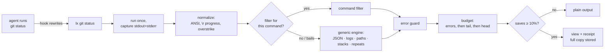

# lx

**Your coding agent reads every line a command prints. lx makes it read the lines that matter, and it never hides an error.**

[](https://github.com/iheeb1/lx/actions/workflows/ci.yml)    

`lx` sits between an AI coding agent (Claude Code, Codex, Gemini CLI, Copilot, Cursor…) and the commands it runs (`git`, `go test`, `pytest`, `jest`, `tsc`, `eslint`, `grep`, `find`, `npm`, `docker`…). It prints a condensed view of their output. The exit code stays the same, every error survives, and anything lx removes can be printed back with one command (`lx show 7`).

| | |
|---|---|
| **91%** | fewer tokens across 116 real command outputs from 11 open-source repos (exact o200k counts) |
| **99%** | of application `file:line` locations kept on failing runs, against **61%** for a head+tail cut to the same size |
| **65** | command filters across git, Go, JS/TS, Python, search/listing, builds, HTTP/JSON and containers, plus a shape-aware engine for every other command |
| **0** | dependencies. It is one static Go binary, with no telemetry and no network code |

---

## Before / after

A failing `go test ./...` in [spf13/cobra](https://github.com/spf13/cobra). The raw output is 306 lines, most of it passing tests' logs. Here is what the agent reads through lx:

```text
$ lx go test ./...
--- FAIL: TestMinimumNArgs_WithLessArgs (0.00s)
    args_test.go:73: Expected "requires at least 2 arg(s), only received 1", got "requires at least 2 arg(s), received 1"
--- FAIL: TestMinimumNArgs_WithLessArgs_WithValid (0.00s)
    args_test.go:73: Expected "requires at least 2 arg(s), only received 1", got "requires at least 2 arg(s), received 1"
--- FAIL: TestMinimumNArgs_WithLessArgs_WithValid_WithInvalidArgs (0.00s)
    args_test.go:73: Expected "requires at least 2 arg(s), only received 1", got "requires at least 2 arg(s), received 1"
--- FAIL: TestFind (0.00s)
    --- FAIL: TestFind/[child_-f_child] (0.00s)
        command_test.go:2876: Wrong args
            Expected: [child -f child]
            Got: [-f child]
[error-like lines printed by passing tests (the rest of their output is hidden):]
Error: at least one of the flags in the group [a b] is required [×4]
[… 11 more such lines, trimmed for this README]
FAIL
FAIL	github.com/spf13/cobra	0.655s
ok  	github.com/spf13/cobra/doc	(cached)
FAIL
[hidden: 237 lines of passing-test output]
[lx: 307→29 lines (−71%) · full output: lx show 1]
```

Every failing test, assertion and `file:line` is still there, in the tool's own format. The last line tells the agent the view is condensed and how to get everything back.

## Results

All numbers below come from `make bench` on real captures. They are reproducible: see [Benchmarks](#benchmarks).


### Fewer tokens is only half the job

The obvious way to save tokens is to cut output: `| tail -40`, or head+tail truncation. Agents already do this, and it drops the error you needed. This chart takes every **failing** run in the corpus and compares lx with the same output cut blind, **to the same number of tokens as lx's view**:


At the same size, lx keeps 96% of the distinct error messages against 64% for head+tail and 47% for `tail -40`. For application `file:line` locations it keeps 99% against 61% and 39%. The error messages lx doesn't show are section headers and passing-test titles that the line classifier matches (for example jest's `Summary of all failing tests` and mocha's `error handling` suite name). `bench/cmd/missing` lists every one of them.

### Compared with rtk

[rtk](https://github.com/rtk-ai/rtk) (Rust Token Killer) is the popular tool in this space and the inspiration for lx. We studied its source (v0.50.0) and issue tracker. A live head-to-head benchmark harness is in `bench/cmd/h2h`; see [docs/benchmark.md](docs/benchmark.md) for the method.

rtk covers more ground: 100+ commands, 18 agents, a large community. lx takes a different position:

| | rtk 0.50 | lx |
|---|---|---|
| Verdict and counts | parsed from text; known false passes, e.g. pytest `3 passed, 1 error` shown as `3 passed` | the tool's own summary line, copied verbatim; the verdict always agrees with the exit code |
| Exit code | preserved, except `golangci-lint` 1 → 0 | always preserved (a property test checks it) |
| Dropped errors | per filter | caught at runtime by an error guard, plus fidelity tests on 116 real captures |
| Lost output | several filters truncate with no way back | every condensed run is stored; `lx show <id> [--grep RE] [--lines A-B]` |
| Unknown commands | passed through raw | shape-aware engine: JSON, logs, path lists, stack traces, repeated lines |
| Token counting | bytes ÷ 4 (≈19% mean error) | pre-tokenizer estimator (≈6% mean error vs o200k), [details](docs/tokens.md) |
| Savings accounting | head/tail counted as saving the whole file; negatives clamped | signed, measured against what the command actually printed |
| Model-written `rtk git push` | escapes `Bash(git push:*)` deny rules | `lx git push` is checked against deny rules as `git push` |
| Commands run | often twice (e.g. `git status`) | exactly once, with your exact argv |

## Install

```sh
go install github.com/iheeb1/lx/cmd/lx@latest   # or: git clone https://github.com/iheeb1/lx && cd lx && make install
lx version
```

This needs Go 1.26+ to build. The result is a single static binary with no runtime dependencies.

## Use it with your agent

### Claude Code

```sh
lx init            # adds a PreToolUse hook to ~/.claude/settings.json (backup kept, other hooks untouched)
lx init --project  # or only for this repository (.claude/settings.json)
lx init --dry-run  # show the change without writing it
lx init --uninstall
```

The hook rewrites Bash commands lx understands (`git status` → `lx git status`) and leaves everything else alone. Commands are never rewritten if they:

- use pipes into anything other than `head`/`tail`/`cat`;
- use file redirects, `$(…)`, heredocs, subshells or loops;
- run watchers, servers or interactive tools;
- ask for machine-readable output (`--porcelain`, `--json`, `-z`, `--format=…`).

Permissions work like this:

- If a deny rule matches the original command, lx doesn't rewrite it and Claude Code's own deny applies.
- If every part matches an allow rule, the rewrite is approved.
- Otherwise you get the normal prompt.

A command the model writes as `lx …` is checked against your deny rules as if lx weren't there.

### Other agents

```sh
lx init --agent agents-md   # AGENTS.md block (Codex, and any agent that reads AGENTS.md)
lx init --agent gemini      # Gemini CLI BeforeTool hook
lx init --agent copilot     # GitHub Copilot CLI preToolUse hook
lx init --agent cursor      # Cursor hooks.json
```

For your own tooling, `lx rewrite '<command>'` prints the lx form of a shell command and exits 1 when there is nothing to change.

## Commands

```text
lx <command> [args…]          run it, print the condensed view, exit with its exit code
lx show [id] [--grep RE] [--lines A-B] [--raw]
                              print the full output of a condensed run (no id: list recent runs)
lx gain [--days N] [--json]   tokens saved so far, by command, with a daily sparkline
lx discover [--days N]        replay your real Claude Code transcripts through lx and measure
                              what it would have saved (and which commands it doesn't cover)
lx pipe --as "go test ./..."  condense stdin as if it were that command's output
lx rewrite '<cmd>'            the lx form of a shell command (for hooks and scripts)
lx init / lx hook claude      agent integration
lx filters                    list the built-in filters
```

`lx -r <cmd>` or `LX_RAW=1` runs a command untouched, and `lx -b 3000 <cmd>` sets a smaller output budget.

`lx discover` is the honest way to size the benefit before you install the hook. It reads your own session transcripts, finds every Bash call lx would have rewritten, and runs lx's filters on the output that was actually recorded. The result is measured, not estimated from a table of percentages. Only command names (`git status`, `npm test`) appear in its report.

## What lx does to each tool

| Tool | What the agent sees |
|---|---|
| `git status` | git's own short format (`## main...origin/main [ahead 2]`, `MM file`), conflicts first; mid-rebase or mid-merge hints kept |
| `git log` / `show` / `diff` / `blame` / `branch` | one line per commit, with meaningful body lines kept (BREAKING, Fixes #, Revert…); hunks verbatim; lockfiles and generated files summarized with changed package@versions; conflict markers always flagged |
| `git push` / `pull` / `fetch` / `clone` | progress noise gone; ref updates, rejections and hints verbatim |
| `go test` / `build` / `vet` / `mod` | failing tests with all their output; panics and goroutine dumps grouped by stack; `-json` rendered as text; downloads counted |
| `jest` / `vitest` / `mocha` / `npm test` | every failure block (message, expected/received, code frame, app frames); suites that fail to load always shown; summary lines verbatim; coverage tables reduced to failing rows |
| `tsc` / `eslint` | every error kept with its location; `--pretty` code frames dropped; repeated eslint messages grouped per file with all line:col positions |
| `npm` / `pnpm` / `yarn` / `bun` install, ls, audit, build | deprecations folded into one line (security-related ones kept in full); every `npm error` kept; audit advisories kept, dependency paths counted |
| `pytest` / `pip` / `mypy` / `ruff` / Python tracebacks | failure blocks with `>` and `E` lines and locations; the final `N failed, M passed, K errors` line verbatim; progress dots counted; site-packages frames folded |
| `grep` / `rg` / `git grep` | matches grouped by file, long (minified) lines windowed around the match, per-file caps with exact counts, dependency-directory noise summarized |
| `ls` / `find` / `du` / `tree` | constant columns noted once; path lists as a tree with numbered siblings written as brace expansions (`vite{2..8}.md`) so every path can still be opened |
| `make` / `cc` / `cmake` / `ninja` / `cargo` / `gradle` / `mvn` | compiler commands counted; every diagnostic block kept; include chains folded; `make test` output handed to the inner tool's filter |
| `curl` / `wget` / `httpie` / `jq` / `cat` | large JSON compacted (error fields first, arrays of objects as tables); headers trimmed unless status ≥ 400; source files never altered (large ones windowed with line numbers) |
| `docker` / `kubectl` / `journalctl` | tables trimmed; logs templated (Drain-style) with every error record kept verbatim; stack traces folded, never dropped; BuildKit noise gone |
| anything else | generic engine: ANSI and progress stripped, repeated and similar lines collapsed, stack traces folded, JSON/log/path shapes detected |

## Guarantees

These are the invariants lx is built around. Each one is enforced by tests over real captured output:

1. **The exit code is never changed.** lx exits with the child's status, and 128+N if it was killed by a signal.
2. **Error lines are never silently removed.** Command filters keep them, and their fidelity tests prove it on real captures. For everything else, a runtime guard re-appends any error line that went missing. The budget stage keeps error lines before anything else.
3. **Never worse.** If condensing saves less than 10% of the tokens, you get the plain output.
4. **Nothing is lost.** When anything is removed, the full output is stored (mode 0600, the newest 200 runs, at most 7 days). The receipt line says how to get it back.
5. **Filters can't hurt you.** A filter that panics or doesn't recognize its input falls back to the generic engine.
6. **The command runs as you wrote it.** It runs once, with your exact argv, stdin and environment. lx never injects flags.
7. **Machine output is untouched.** `--json`, `--porcelain`, `-z`, `--format=…` and similar output is passed through byte for byte. So are watchers, servers and interactive programs, streamed live.

## How it works



The budget defaults to 8,000 tokens (`LX_BUDGET`). That keeps every view under Claude Code's ~30k-character limit, beyond which it would truncate or spill the output itself.

Token counts come from an offline estimator that reproduces the cl100k/o200k pre-tokenizer and prices each piece with curves fitted against real `tiktoken` counts. Its mean error is 6%, against 19% for `bytes ÷ 4`. See [docs/tokens.md](docs/tokens.md).


## Testing

- **A corpus of real output.** `testdata/corpus` holds 116 captures of real commands (git, go, npm, jest, vitest, mocha, tsc, eslint, pytest, pip, grep, rg, find, ls, curl, make…) run in 11 open-source repositories, including deliberately broken builds and failing tests. Each filter package adds its own real and synthetic variants: 422 more captures.
- **518 golden files.** Each one is the exact text an agent reads for a capture. `make golden` regenerates them, and every diff gets reviewed.
- **Fidelity properties on every capture.** The error guard adds nothing, error messages and `file:line` locations survive, the verdict agrees with the exit code, and a filter bails on localized or unknown formats.
- **17 fuzz targets.** No panics; output is deterministic; the fast classifier equals the reference regex exactly.
- **Adversarial review.** Every filter group was reviewed by a second engineer whose job was to produce false passes, lost errors and slow cases. Each bug found has a regression test.
- **Scale.** Timing tests feed every filter 50,000-line inputs to catch algorithmic blowups (most take under 100 ms), and the suite passes under `-race`.

```sh
go test ./...          # 501 tests, ~2,000 subtests
go test -race ./...
make golden            # after an intentional output change
```

## Benchmarks

```sh
make bench                                  # corpus → bench/out/results.json (+ views of every capture)
pip install tiktoken && python3 bench/tiktoken_counts.py   # exact cl100k/o200k counts
go run ./bench/cmd/h2h -env … -rtk $(which rtk) -lx ./lx    # live head-to-head (see the file header)
make charts                                 # docs/img/*.svg
```

A note on what these numbers mean. They measure the tokens of **command output** an agent reads, not your total bill. System prompts, file reads, your messages and the model's own output are untouched, and prompt caching changes what re-reading costs. `lx discover` measures the share that applies to *your* sessions.

## Configuration

| Variable | Effect |
|---|---|
| `LX_RAW=1` | run commands untouched |
| `LX_BUDGET=N` | output token budget (default 8000) |
| `LX_TEE=0` | don't store full outputs (`lx show` then has nothing to show) |
| `LX_TRACK=0` | don't record savings for `lx gain` |
| `LX_HOOK=0` | make the agent hook a no-op |
| `LX_TEE_DIR`, `LX_DATA_DIR` | where stored outputs and the savings log live |

**Privacy:** `lx gain` records only the tool and subcommand (`git status`), token counts, the duration and the exit code. It never records arguments or output. Stored full outputs live in your user cache directory with mode 0600 and expire after 7 days. lx makes no network calls.

## Limitations

- Claude Code's built-in Read, Grep and Glob tools don't go through Bash, so the hook can't see them.
- A rewritten command no longer matches Claude Code's built-in auto-approval of read-only commands. You may be prompted for `lx git status` where `git status` ran silently. Approve it once with "don't ask again", or add specific rules such as `Bash(lx git status:*)`. Never add `Bash(lx:*)`: lx runs arbitrary commands.
- Shell aliases and functions named like a supported tool are bypassed by `lx <tool>`, as they are with rtk.
- Filters for cargo, gradle, docker and kubectl are verified against synthetic fixtures in the tools' real formats, because those tools weren't available on the capture machine. Everything else is verified on real captures. Windows is untested.
- Parsers recognize English tool output. For localized output they fall back to the generic engine rather than guess.

## Adding a filter

1. Capture real output: run the command and save stdout+stderr, not in a TTY.
2. Add a type with `Name`, `Match` and `Apply` to a package under `internal/filters/` and `engine.Register` it. `Apply` returns `ok=false` for anything it doesn't positively recognize.
3. Add a golden test and the fidelity checks (see `internal/filters/git/status_test.go`).
4. Run `go test ./...` and `make bench`, then look at the view as the agent would.

## License

MIT
